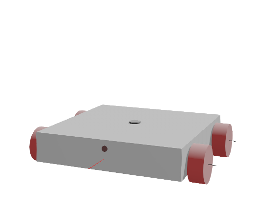
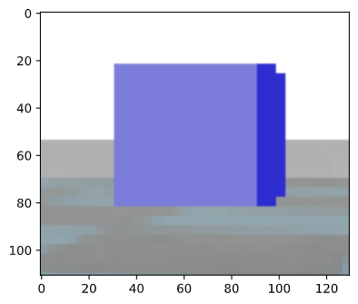
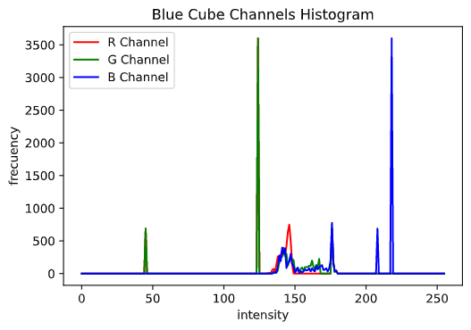
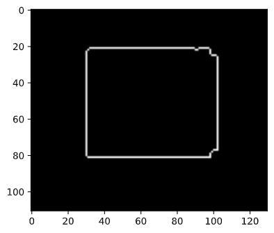
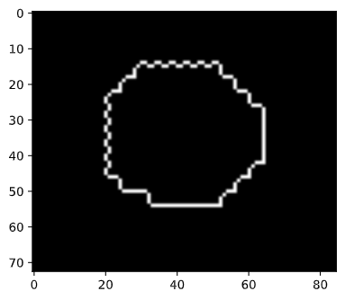
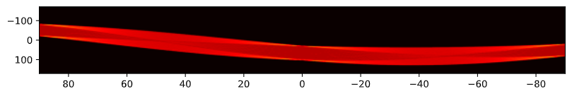
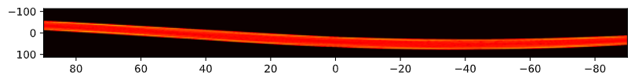
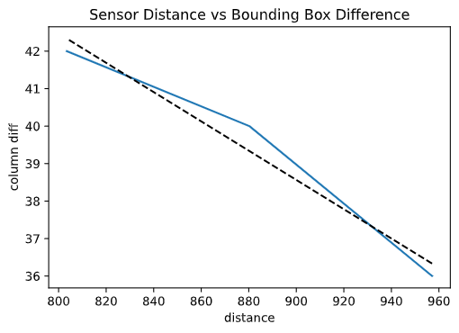

### Author: Alberto Bella
### University: Adolfo Ibañez

# Visual Recognition - Webots

## Abstract
According to the given task, the objective is to develop an algorithm that allows a robot, with design free of choice, to move straight to objects that share the same space as the robot. This objects must be spheres and cubes, and must contain the color red or green. The robot must move directly to the object. Once it's identified and visited, then it must turn and search other object, so it could do the same and repite the task, until all the objects are visited. The idea of this task, is to develop an visual recognition algorithm, and according to what and how the robot identifies, program it's behaviour.

## Introduction

According to how the problem was approched, in this particular case, the elements in the map were situated in completly different positions, and far from each. The robot was put in the center. The Design of the robot wasn't though to solve this specific problem, but to give it structure and physics so it could be allowed to achive the objective.

Webots diagram:

Robot
- children
    - DEF WHEEL1 HingeJoint
        - jointParameters HingeJointParameters
            - anchor 0.28 -0.02 0.15
        - device
            - RotationalMotor 'wheel1'
                - name 'wheel1'
        - endPoint DEF WHEEL1 Solid
            - translation 0.28 -0.02 0.15
            - rotation 0 0 1 1.5708
            - children
                - DEF WHEEL Shape
                    - geometry Cylinder
                        - height 0.05
                        - radius 0.06
            - boundingObject USE WHEEL
            - physics Physics
    - DEF WHEEL2 HingeJoint
        - jointParameters HingeJointParameters
            - anchor 0.28 -0.02 -0.15
        - device
            - RotationalMotor 'wheel2'
                - name 'wheel2'
        - endPoint DEF WHEEL1 Solid
            - translation 0.28 -0.02 -0.15
            - rotation 0 0 1 1.5708
            - children
                - USE WHEEL
            - boundingObject USE WHEEL
            - physics Physics
    - DEF WHEEL3 HingeJoint
        - jointParameters HingeJointParameters
            - anchor -0.28 -0.02 0.15
        - device
            - RotationalMotor 'wheel3'
                - name 'wheel3'
        - endPoint DEF WHEEL1 Solid
            - translation -0.28 -0.02 0.15
            - rotation 0 0 1 1.5708
            - children
                - USE WHEEL
            - boundingObject USE WHEEL
            - physics Physics
    - DEF WHEEL4 HingeJoint
        - jointParameters HingeJointParameters
            - anchor 0.28 -0.02 0.15
        - device
            - RotationalMotor 'wheel4'
                - name 'wheel4'
        - endPoint DEF WHEEL1 Solid
            - translation -0.28 -0.02 -0.15
            - rotation 0 0 1 1.5708
            - children
                - USE WHEEL
            - boundingObject USE WHEEL
            - physics Physics
    - DEF BODY Shape
        - children
            - geometry Box
                - size 0.5 0.1 0.5
    - Camera 'camera'
        - translation 0 0.22 0.25
        - rotation 0 -1 0 3.14159
        - children
            - DEF CAMERA Shape
                - geometry Sphere
                - radius 0.01
        - boundingObject USE CAMERA
        - physics Physics
    - Display 'display'
- boundingObject DEF BODY Shape
- physics Physics

It includes a display to show the render image with red borders around the object. In consideration, there are other ways to achive this. In this way, in the software (Webots) are rendered two screens, one for the camera (original) and another one for the display (with the new image). The whole file is separated in four sections; import of modules and libraries, functions declaration, variables and constants declaration, and the main loop.

In the first section, the following modules and libraries are included: controller (Webots); time, for time calculations; numpy, for matrix and arrays operations, given that images are considered three dimensional matrix; cv2 (openCV), for image processing; and skimage, for also image processing, but to meassure and get image features.

Following, four main functions are declared. For object recognition, movement, and to compute the distance between the robot and the object. Finally, each variable's intention and main loop final arquitecture will be explained according to the needs that fulfill.

## Object Recognition

The basic idea is to verify if there is a specific color in the image. If it's true, then proceedes to process it to add the red borders, extract some properties and identify what possible shape could the object has.

`Blue Cube`

Color detection is simple. From the respective array, just verify if there is high intensity in one of the three channels. However, the threshold will vary depending on many factors, such as ilumination and shadows. The render of the blue cube is an example of what the camera captures. From the histogram of the picture, several peaks can be identified form every channel. In the blue channel, the two last peaks represent the front and side face of the cube.

The next picture shows an example of selecting the range of the blue channel based on the previous histogram.

`Threshold`

After applying a binary threshold, some important features can be extracted, which will be used as variables moreover. For the porpouse of the problem, it's only needed the centroid of the region and the max and min row and column. This results can be obtained after applying regionprops, from skimage library. The centroid will be used to align the movement of the robot, and for the other values, to estimate the distance between the robot and the object.

Before identifying the shape of the object, the border is needed. For this, the best option is Canny operator. It combines noise reduction, finding the intensity gradient of the image, non-maximun supression and hysteresis thresholding.

`Canny: Cube`

With this results, can be easily render the new image with its red borders. The final step is to identify the shape. One way to handle this problem, is to check if there are lines crossing between each other almost perpendicular. Another way, which in this case is simpler and so reduces the computational calculations, is to count how many peaks are in the border. Logically speaking, if there are to many, and so the degree's variation between each peak is soft, it could be a circle, or in this case, a sphere. Lets take the following image to compare results.

`Canny: Sphere`

The Hough transform is a method to detect straigh lines. It can be used to detect specific shapes. But in this case, the angle of the camera may hinder the calculation. The method computes the angle variation of a line from the corner of the image to the border of the region.

`Hough Lines: Square`

`Hough Lines: Circle`

The number of peak lines obtained from the image with the circle is greater than the number of peak lines obtained from the square. The number will vary, so improving this approach may make more precise the algorithm.

Finally, to calculate the distance from the object, several meassures were made from the boundary box obtained from regionprops function, and the actual distances with the distance sensor of webots. It's important to consider that the size of the object used to meassure was 0.05 x 0.1 x 0.1.

## Movement

The function 'Recognition' returns False if no color was identified. Otherwise, returns the new image to be rendered, the centroid of the region, the estimated shape, the estimated distance and the color. Basically, if the robot is to far from the object, the robot will go and take 'a look'. That's because is very difficult to estimate the shape when the object is to far. When it's from a decent distance, then it consider the object as 'visited' and proceeds to search the next object. It is important to consider that if there are two objects sharing the same screen, the algorithm will prioritize the first recognize color. So it shouldn't work when two objects are too close.

## Results

`First results: Rotation to the right`

`Second results: Rotation to the left`

## Conclusions

The intention of the task was not to develop a search algorithm, but to make the robot capable of recongizing shapes and colors. It does do the job, however, it has some limitations. It wasn't developed the avoiding obstacle's algorithm, which is important to consider before any implementation. The robot can't also identify more than one object that share the same screen. It will stay with the first identified color (in this case red). Also, before testing the code, changing the sense of the rotation of the robot must apply for all the 'Rotate' functions.

## References

1. Wikipedia contributors. (2021, June 23). Canny edge detector. In Wikipedia, The Free Encyclopedia. Retrieved 03:35, July 14, 2021, from https://en.wikipedia.org/w/index.php?title=Canny_edge_detector&oldid=1030086759
